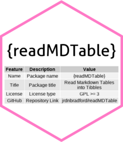

```{r, echo = FALSE}
knitr::opts_chunk$set(
  collapse = TRUE,
  comment = "#>",
  fig.path = "README-"
)
```

# readMDTable <a href="https://jrdnbradford.github.io/readMDTable/"></a>

<!-- badges: start -->
[](https://github.com/jrdnbradford/readMDTable/actions/workflows/R-CMD-check.yaml)
[](https://cran.r-project.org/web/checks/check_results_readMDTable.html)
[](https://CRAN.R-project.org/package=readMDTable)
[](https://github.com/jrdnbradford/readMDTable)
[](https://www.gnu.org/licenses/gpl-3.0)
[](https://app.codecov.io/gh/jrdnbradford/readMDTable)
[](https://cran.r-project.org/web/packages/readMDTable/index.html)
[](https://cran.r-project.org/web/packages/readMDTable/index.html)
<!-- badges: end -->

readMDTable helps convert raw markdown tables from a string, file, or URL to tibbles. 

Many sites (like GitHub) convert markdown tables into HTML tables. For these types of tables you may be better off using [rvest](https://rvest.tidyverse.org/).

## Installation

Install the latest CRAN release with:
```{r, eval=FALSE}
install.packages("readMDTable")
```

Install the development version from GitHub using pak:
```{r, eval=FALSE}
pak::pkg_install("jrdnbradford/readMDTable")
```

or devtools:
```{r, eval=FALSE}
devtools::install_github("jrdnbradford/readMDTable")
```

## Usage
```{r, echo=FALSE, include=FALSE}
devtools::load_all()
```

If the have a string, file, or URL whose entire content is just a markdown *table*, you should use `read_md_table` which will return a tibble. 

If the string, file, or URL is a markdown file that has *other content* besides just a table or tables, such as headings, paragraphs, etc, you should use `extract_md_tables` which will parse the file, pass the tables to `read_md_table`, and return a tibble or list of tibbles.

### From a File
Read in an example markdown table from the package:
```{r}
mtcars_file <- read_md_table_example("mtcars.md")

read_md_table(mtcars_file)
```

Read in an example markdown file that has multiple tables:
```{r}
mtcars_file <- read_md_table_example("mtcars-split.md")

extract_md_tables(mtcars_file, show_col_types = FALSE)
```

### From a String
```{r}
read_md_table("| len | supp | dose |\n|---|---|---|\n| 4.2 | VC | 0.5 |")
```

### From a URL
```{r}
read_md_table("https://raw.githubusercontent.com/jrdnbradford/readMDTable/main/inst/extdata/iris.md")
```
```{r}
extract_md_tables("https://raw.githubusercontent.com/jrdnbradford/readMDTable/main/inst/extdata/ToothGrowth.md")
```

### Warnings and Messy Data
`read_md_table` will throw warnings if there are potential issues with the markdown table. In many cases it will still correctly read in the messy data:
```{r}
read_md_table(
"  | Name   | Age |            City        | Date   |
|-------|-----|-------------|------------|
  | Alice |      30 |           | 2021/01/08 |
  | Bob          | 25  | Los Angeles | 2023/07/22      
  | Carol | 27       | Chicago     |      |"
)
```

`extract_md_tables` may fail to recognize markdown tables with improper formatting, with the result that it won't pass on the content to `read_md_table` and therefore won't return a tibble for that table.
