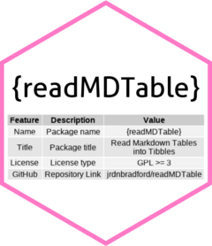

```{r options, echo = FALSE}
knitr::opts_chunk$set(
  collapse = TRUE,
  comment = "#>",
  fig.path = "README-"
)
```

# readMDTable <a href="https://jrdnbradford.github.io/readMDTable/"></a>

<!-- badges: start -->
[](https://github.com/jrdnbradford/readMDTable/actions/workflows/R-CMD-check.yaml)
[](https://cran.r-project.org/web/checks/check_results_readMDTable.html)
[](https://CRAN.R-project.org/package=readMDTable)
[](https://github.com/jrdnbradford/readMDTable)
[](https://www.gnu.org/licenses/gpl-3.0)
[](https://app.codecov.io/gh/jrdnbradford/readMDTable)
[](https://CRAN.R-project.org/package=readMDTable)
[](https://CRAN.R-project.org/package=readMDTable)
<!-- badges: end -->

readMDTable helps convert raw markdown tables from a string, file, or URL to tibbles.

Many sites (like GitHub) convert markdown tables into HTML tables, making both available. See the vignette [Benchmarking Against rvest](https://jrdnbradford.github.io/readMDTable/articles/rvest-benchmarks.html) to help determine if you should use readMDTable or rvest.

## Installation

Install the latest CRAN release with:
```{r cran-install, eval=FALSE}
install.packages("readMDTable")
```

Install the development version from GitHub using pak:
```{r pak-install, eval=FALSE}
pak::pkg_install("jrdnbradford/readMDTable")
```

or devtools:
```{r devtools-install, eval=FALSE}
devtools::install_github("jrdnbradford/readMDTable")
```

## Usage
```{r install, echo=FALSE, include=FALSE}
library(readMDTable)
```
If you have a string, file, or URL whose entire content is just a markdown *table*, you should use `read_md_table` which will return a tibble.

If the string, file, or URL is a markdown *file* that has *other content* besides just a table or tables, such as headings, paragraphs, etc, you should use `extract_md_tables` which will parse the file and return a tibble or list of tibbles.

### From a File
Read in an example markdown table from the package:
```{r example-1}
mtcars_file <- read_md_table_example("mtcars.md")

read_md_table(mtcars_file)
```

Read in an example markdown file that has multiple tables as well as headings and paragraphs:
```{r example-2}
mtcars_file <- read_md_table_example("mtcars-split.md")

extract_md_tables(mtcars_file, show_col_types = FALSE)
```

### From a String
```{r example-3}
read_md_table("| len | supp | dose |\n|---|---|---|\n| 4.2 | VC | 0.5 |\n")
```

### From a URL
```{r example-4}
read_md_table("https://raw.githubusercontent.com/jrdnbradford/readMDTable/main/inst/extdata/iris.md")
```
```{r example-5}
extract_md_tables("https://raw.githubusercontent.com/jrdnbradford/readMDTable/main/inst/extdata/ToothGrowth.md")
```

### Warnings and Messy Data
`read_md_table` will throw warnings by default if there are potential issues with the markdown table. In many cases it will still correctly read in the messy data if you use `force = TRUE`:
```{r example-6}
read_md_table(
"  | Name   | Age |            City        | Date   |
|-------|-----|-------------|------------|
  | Alice |      30 |           | 2021/01/08 |
  | Bob          | 25  | Los Angeles | 2023/07/22
  | Carol | 27       | Chicago     |      |",
  force = TRUE
)
```

`extract_md_tables` will fail to recognize markdown tables that do not fit the markdown table format.
